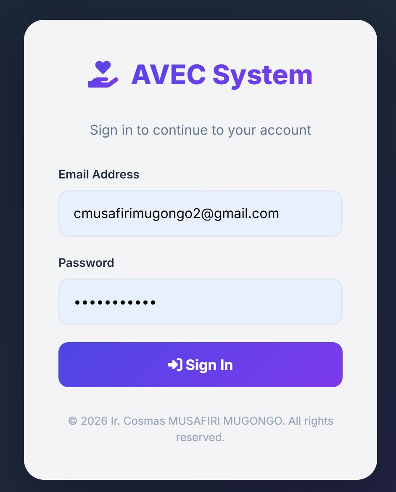
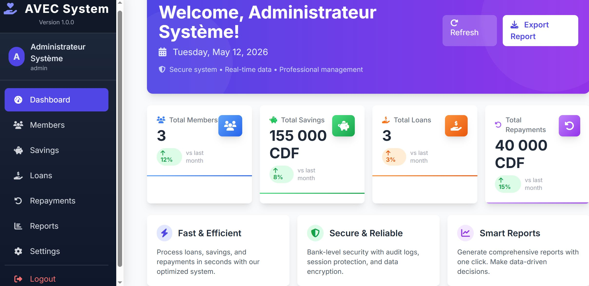
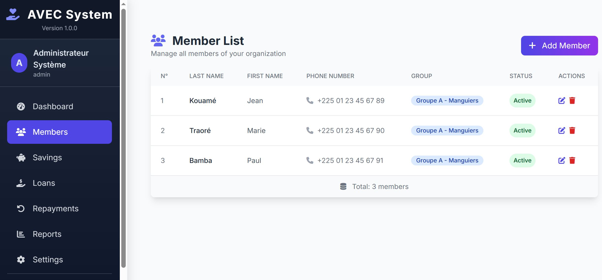
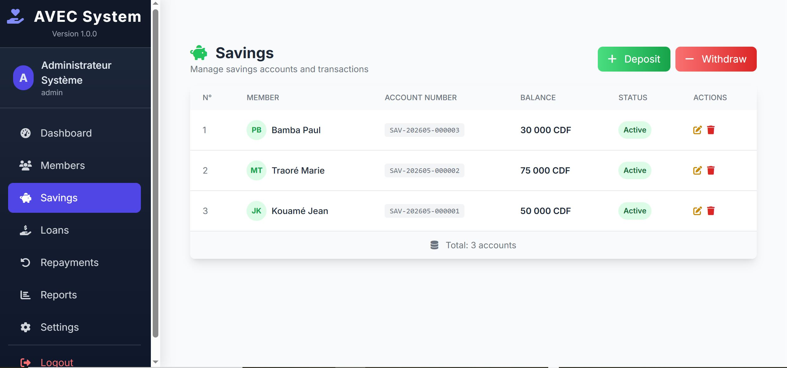
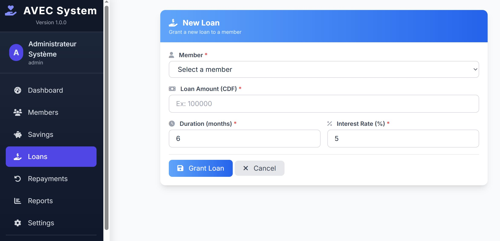
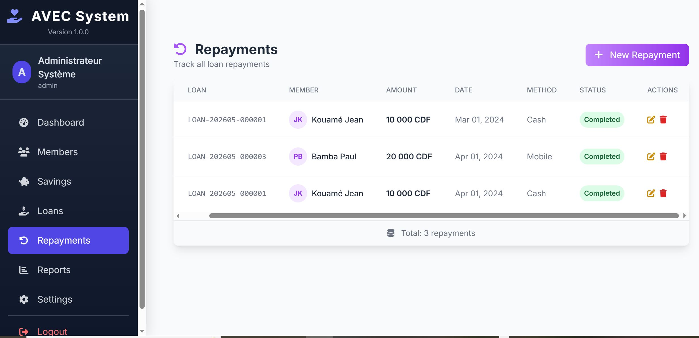
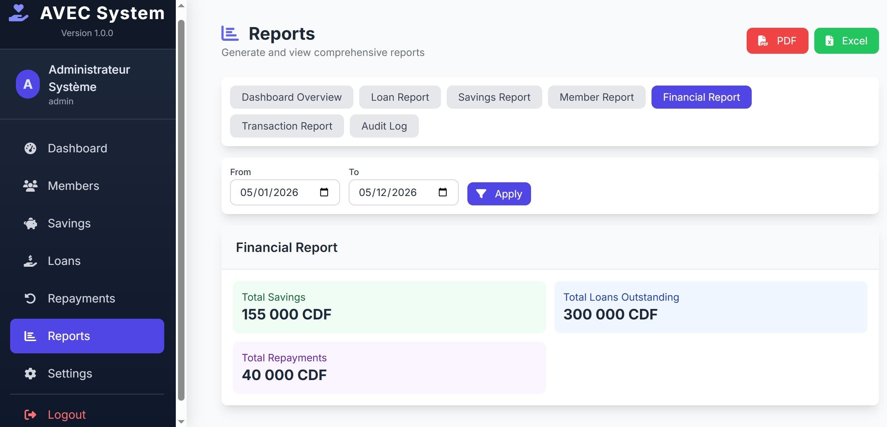
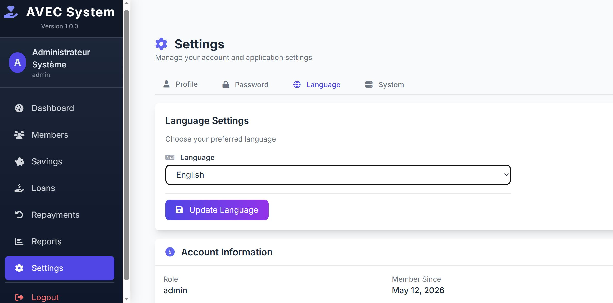

[Insérez le contenu ci-dessus]
<div align="center">

# 🏦 AVEC System

### Village Savings and Credit Association - Management System


</div>

---

## 📋 Table of Contents

- [📖 Overview](#-overview)
- [✨ Features](#-features)
- [📸 Screenshots](#-screenshots)
- [⚙️ Technologies Used](#️-technologies-used)
- [📦 Installation](#-installation)
- [👤 Default Users](#-default-users)
- [🎯 Usage](#-usage)
- [🤝 Contributing](#-contributing)
- [📄 License](#-license)
- [👨‍💻 Author](#-author)

---

## 📖 Overview

**AVEC System** is a comprehensive management system designed for Village Savings and Credit Associations (VSCA). It provides a complete solution for managing members, savings accounts, loans, repayments, and generating professional reports.

The system is built with **PHP** and **MySQL** on the backend, with a modern and responsive user interface using **TailwindCSS**. It includes **PDF export** and **QR Code** generation for reports, making it suitable for both local and cloud deployment.

---

## ✨ Features

| Category | Features |
|----------|----------|
| 👥 **Member Management** | CRUD operations, member profiles, groups management |
| 💰 **Savings Management** | Deposit and withdrawal operations, balance tracking, transaction history |
| 📊 **Loan Management** | Loan application, approval, disbursement, repayment tracking |
| 📄 **Repayment Management** | Record repayments, auto-update loan status |
| 📈 **Reports** | Dashboard overview, loans, savings, members, financial reports |
| 📤 **Export Options** | PDF and Excel export for all reports |
| 📱 **QR Code** | Generate QR codes for reports (requires GD extension) |
| 🌐 **Multi-language** | English, French, Spanish, Swahili |
| 🔒 **Security** | Session management, audit logs, role-based access |
| 🎨 **UI/UX** | Responsive design with TailwindCSS |

---

## 📸 Screenshots

### 🔐 Login Page


### 📊 Dashboard


### 👥 Member Management


### 💰 Savings Management


### 📊 Loan Management


### 📄 Repayment Management


### 📈 Reports


### ⚙️ Settings


---

## ⚙️ Technologies Used

### Backend
- **PHP 8.0+** - Server-side scripting language
- **MySQL 5.7+** - Database
- **PDO** - Database abstraction layer

### Frontend
- **TailwindCSS 3.x** - Utility-first CSS framework
- **Font Awesome 6** - Icons
- **Google Fonts (Inter)** - Typography

### Libraries
- **FPDF 1.86** - PDF generation
- **PHPQRCode** - QR Code generation

### Tools
- **XAMPP** - Local development environment
- **Git** - Version control
- **GitHub** - Repository hosting

---

## 📦 Installation

### Prerequisites

- [XAMPP](https://www.apachefriends.org/) (Apache + MySQL + PHP)
- [Git](https://git-scm.com/)

### Step-by-Step Installation

```bash
# 1. Clone the repository
git clone https://github.com/cosmas-webdev/avec_online.git C:\xampp\htdocs\avec

# 2. Create database
# Open phpMyAdmin and create a database named 'avec_db'

# 3. Import database
# Import the 'database/avec_db.sql' file into 'avec_db'

# 4. Configure database connection
# Edit 'config/database.php' with your database credentials

# 5. Start XAMPP
# Launch Apache and MySQL from XAMPP Control Panel

# 6. Access the application
# Open http://localhost/avec/login.php in your browser